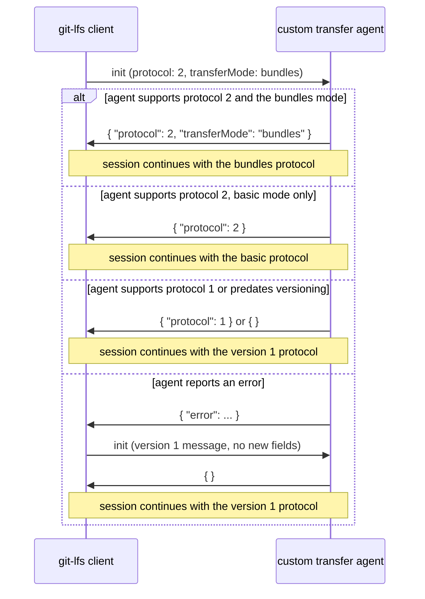
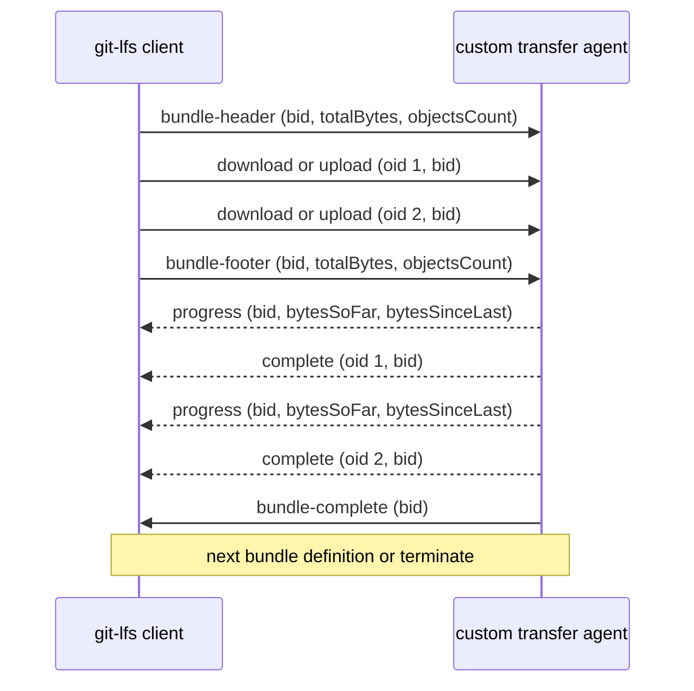
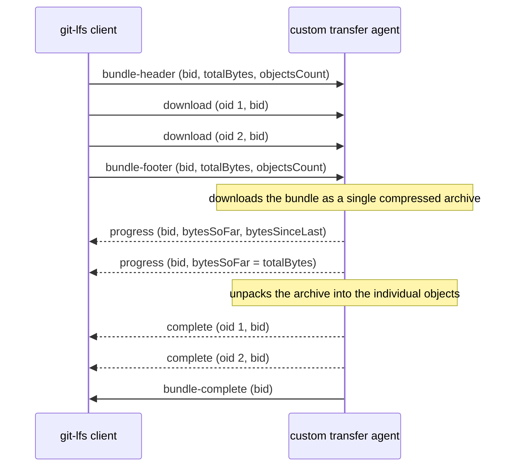

# Custom Transfer Protocol Version 2: Bundles (Proposed Specification)

> **Status: proposal.** This document is a companion to the
> [bundled custom transfers proposal](./custom-transfers-bundling.md) and
> describes a proposed version 2 of the custom transfer protocol. Nothing in
> this document is implemented yet.
> The custom transfer protocol version 1 is specified in the
> [custom transfers documentation](../custom-transfers.md) and remains
> unchanged by this proposal. This document only specifies the changes
> introduced by the version 2.

## Overview

Protocol version 2 extends the custom transfer protocol with:
1. Protocol version negotiation on the initiation stage.
2. The `bundles` transfer mode, where a bundle of objects is the unit of work
for a custom transfer agent process, instead of a single object.
3. An optional `retry` flag on the completion messages, allowing agents to
report retriable errors without forcing Git LFS to fall back to the default
transfer agent.

The general communication mechanics are unchanged: the git-lfs client
communicates with the custom transfer process via the stdin and stdout
streams, no file content is communicated on these streams, and every message
is a single line of JSON as per the version 1 specification.

## Configuration

The following new configuration values are proposed:

* `lfs.customtransfer.<name>.protocol`

  Specifies which protocol version the custom transfer process supports. Can
  be set to either `1` or `2`. If unspecified, protocol version `1` is used
  and the behaviour is exactly the version 1 behaviour, which keeps existing
  custom transfer configurations working without any changes.

* `lfs.customtransfer.<name>.transferMode`

  Specifies the transfer mode: the unit of work handed to the custom transfer
  process. Can be set either to `basic` or `bundles`. The default if
  unspecified is `basic`.
  The `bundles` mode requires protocol version `2`: if the `bundles` mode is
  configured while the protocol version is `1` or unspecified, Git LFS emits
  a warning and uses the `basic` mode with the version 1 protocol.
  The `bundles` mode must also be confirmed by the custom transfer process on
  the initiation stage, the `basic` mode is assumed otherwise (see the
  initiation stage description below).

* `lfs.customtransfer.<name>.bundleSize`

  Specifies the maximum number of objects that can be included in a single
  bundle when the `bundles` transfer mode is used. The number of objects in a
  bundle can be less if there are not enough objects left in the transfer
  queue, but never more. The default if unspecified is `100`, which aligns
  with the `lfs.transfer.batchSize` default value, so that by default a
  single batch API response can be processed as a single bundle.

## Transfer modes

The transfer mode defines the unit of work Git LFS hands to a custom
transfer process and, with that, the way the objects from the transfer queue
are scheduled to the processes.

In the `basic` mode a single object is the unit of work: every process
receives a single object per transfer operation and reports the result for
it before receiving the next one. Concurrency applies per object - every
concurrent process gets a single unique object to work with per time. This
is the only mode available in protocol version 1 and the default mode in
protocol version 2.

In the `bundles` mode a bundle of objects is the unit of work: every process
receives a whole bundle per transfer operation and reports the progress and
the results for all the objects of the bundle before receiving the next
bundle. Concurrency applies per bundle - every concurrent process gets a
bundle of unique objects to work with per time.

Bundle composition is a Git LFS responsibility. Git LFS assembles the
bundles from the transfer queue according to the `bundleSize` setting and
explicitly closes every bundle definition sent to an agent process with a
footer message. When the transfer queue has fewer objects left than the
configured `bundleSize`, Git LFS flushes the remaining objects as a smaller
bundle instead of waiting for a full one, so an agent never has to guess
about the transfer queue state and never needs to rely on timers to detect
the end of the queue.

## Protocol version negotiation

Git LFS needs a way to negotiate the protocol version with the transfer
agent process to ensure that both sides agree on the version of the protocol
being used. The effective protocol version is determined on the initiation
stage and cannot be changed once the transfer process is initialized.

The negotiation process is arranged according to the following rules:
1. Git LFS always starts the negotiation by sending the initiation message
    with the currently configured protocol version. The protocol version is
    configured via the `lfs.customtransfer.<name>.protocol` setting. If this
    setting is not specified Git LFS assumes protocol version `1` and sends
    the version 1 initiation message without any of the new fields.
2. The custom transfer process should respond with the supported protocol
    version and the features to be used during the session.
3. If the custom transfer process responds with the same protocol version as
    the one sent by Git LFS, Git LFS will continue the session using the
    current protocol version features.
4. If the custom transfer process responds with a lower protocol version than
    the one sent by Git LFS, Git LFS will switch to the lower protocol version
    and continue the session using the lower protocol version features.
5. If the custom transfer process responds with an unrecognized protocol
    version (for example a version higher than the one sent by Git LFS),
    Git LFS will terminate the session with an error.
6. If the custom transfer process responds with no explicit protocol version,
    Git LFS will continue the session using the protocol version 1. This
    allows backward compatibility with existing custom transfer
    implementations that don't support the protocol version negotiation and
    respond with an empty confirmation structure.
7. If the custom transfer process responds with an error to a versioned
    initiation message, Git LFS will restart the process and retry the
    initiation once with a version 1 message without any of the new fields,
    to interoperate with existing implementations that reject messages with
    unknown fields. The process is restarted because its state after a failed
    initiation is undefined. If the version 1 initiation fails as well, the
    session is terminated with an error, as in the version 1 protocol.

Whenever the negotiation results in a lower protocol version or a lesser
transfer mode than the configured ones, Git LFS emits a clear warning
message about the fallback, so a misconfiguration does not silently degrade
the transfer behaviour.



## Stage 1: Initiation

In case the protocol version is configured to `2` the initiation message
looks like this:

```json
{ "event": "init", "operation": "download", "remote": "origin", "concurrent": true, "concurrenttransfers": 3, "protocol": 2, "transferMode": "bundles" }
```

* `event`: always `init` to identify this message
* `operation`: will be `upload` or `download` depending on transfer direction
* `remote`: the Git remote. It can be a remote name like `origin` or an URL
  like `ssh://git.example.com//path/to/repo`. A standalone transfer agent can
  use it to determine the location of remote files.
* `concurrent`: reflects the value of `lfs.customtransfer.<name>.concurrent`,
  in case the process needs to know
* `concurrenttransfers`: reflects the value of `lfs.concurrenttransfers`, for
  if the transfer process wants to implement its own concurrency and wants to
  respect this setting.
* `protocol`: the currently configured protocol version. This is configured
  via the `lfs.customtransfer.<name>.protocol` setting.
* `transferMode`: the currently configured transfer mode. This is configured
  via the `lfs.customtransfer.<name>.transferMode` setting. This field is
  only included when the configured mode is `bundles`; the `basic` mode is
  the default and is never sent explicitly, which keeps the message
  compatible with implementations that don't know about the transfer modes.

The transfer process should use the information it needs from the initiation
structure, and also perform any one-off setup tasks it needs to do. It should
then respond on stdout with a confirmation structure containing the protocol
version and the features to be used during the session:

```json
{ "protocol": 2, "transferMode": "bundles" }
```

* `protocol`: the protocol version supported by the custom transfer process.
  The negotiation rules above apply to this value.
* `transferMode`: optional value to confirm the transfer mode to use. If
  this value is set to `bundles` - this confirms the bundles mode support
  and enables it, and all further communications are performed according to
  the bundles protocol. If this value is not specified or set to `basic` -
  the session continues in the basic mode and all further communications are
  performed according to the basic protocol. If the configured `bundles`
  mode is not confirmed, Git LFS emits a warning about the fallback.

Or, if the transfer process is aware of the newer protocol version but does
not support it:

```json
{ "protocol": 1 }
```

Or, an existing version 1 implementation will simply respond with an empty
confirmation structure:

```json
{ }
```

In both of the latter cases Git LFS will continue the session using the
protocol version 1.

Or, if there was an error:

```json
{ "error": { "code": 32, "message": "Some init failure message" } }
```

In this case the negotiation rule 7 applies: Git LFS retries the initiation
once with a version 1 message before giving up.

## Stage 2: Transfers (bundles mode)

After the initiation exchange, git-lfs will send any number of bundle
definitions to the stdin of the transfer process. A bundle definition
consists of a header message, the individual object transfer messages and a
footer message, each on its own single line.

Every agent process handles a single bundle per time: the next bundle
definition is only sent to a process after the previous bundle transfer is
completed. When the `concurrent` setting is enabled, git-lfs spawns multiple
agent processes according to `lfs.concurrenttransfers` and every process
receives its own bundles, so different bundles are processed concurrently by
different processes.

The exact ordering of the response messages inside a bundle transfer depends
on the processing strategy chosen by the agent (see the processing
strategies section below). For an agent that processes the objects of a
bundle individually the progress and completion messages interleave as the
objects finish:



### Bundle Header

The first message of a bundle definition is always the bundle header, which
carries the general bundle data: the bundle identifier and the totals for the
bundle that follows.

```json
{ "event": "bundle-header", "bid": "bundle-1", "totalBytes": 3072, "objectsCount": 2 }
```

* `event`: always `bundle-header` to identify this message
* `bid`: unique identifier of this bundle, persistent throughout all the
  messages of the bundle transfer
* `totalBytes`: total size in bytes of all the objects in the bundle
* `objectsCount`: the number of objects that will follow in this bundle

### Bundle Objects

Next git-lfs sends the individual objects that are part of the bundle. The
number of objects is defined in the bundle header, and each object is sent
as a separate message. Each object transfer is an upload or a download,
depending on the operation defined in the initiation message.

For uploads the message looks like this:

```json
{ "event": "upload", "oid": "bf3e3e2af9366a3b704ae0c31de5afa64193ebabffde2091936ad2e7510bc03a", "bid": "bundle-1", "size": 1024, "path": "/path/to/file.png", "action": { "href": "nfs://server/path", "header": { "key": "value" } } }
```

* `event`: always `upload` to identify this message
* `oid`: the identifier of the LFS object
* `bid`: the identifier of the bundle as defined in the `bundle-header`
* `size`: the size of the LFS object
* `path`: the file which the transfer process should read the upload data from
* `action`: the `upload` action copied from the response from the batch API.
  This contains `href` and `header` contents, which are named per HTTP
  conventions, but can be interpreted however the custom transfer agent
  wishes. `action` is `null` for standalone transfer agents.

For downloads the message looks like this:

```json
{ "event": "download", "oid": "22ab5f63670800cc7be06dbed816012b0dc411e774754c7579467d2536a9cf3e", "bid": "bundle-1", "size": 2048, "action": { "href": "nfs://server/path", "header": { "key": "value" } } }
```

* `event`: always `download` to identify this message
* `oid`: the identifier of the LFS object
* `bid`: the identifier of the bundle as defined in the `bundle-header`
* `size`: the size of the LFS object
* `action`: the `download` action copied from the response from the batch
  API, same as for uploads. `action` is `null` for standalone transfer
  agents.

Note there is no file path included in the download request; the transfer
process should create a file itself and return the path in the object
completion message (see below).

### Bundle Footer

Last git-lfs sends a bundle footer message to indicate the end of the bundle
definition. This message signals that no more objects will be sent for this
bundle. The bundle footer is always sent explicitly, including for the bundles
that are smaller than the configured `bundleSize`, so the transfer process
never has to infer the transfer queue state.

```json
{ "event": "bundle-footer", "bid": "bundle-1", "totalBytes": 3072, "objectsCount": 2 }
```

* `event`: always `bundle-footer` to identify this message
* `bid`: the same bundle identifier as used in the `bundle-header`
* `totalBytes`: total size in bytes of all the objects in the bundle, matches
  the `totalBytes` of the `bundle-header`
* `objectsCount`: the number of objects in the bundle, matches the
  `objectsCount` of the `bundle-header`

### Processing strategies

Once a bundle definition is complete (after receiving the bundle footer), the
transfer process is free to choose how the objects within the bundle are
processed: one by one in the order received, packed into a single archive or
compressed stream, deduplicated across the bundle, or using any other
strategy that fits the concrete use case. The bundle is the unit of work, and
the object completion messages can be sent in any order as objects finish
processing.

Parallelism, however, is not a bundle-level concern: it is controlled by the
`lfs.customtransfer.<name>.concurrent` and `lfs.concurrenttransfers` settings
exactly as for the basic mode, and applies per bundle - git-lfs spawns
multiple agent processes and gives each of them its own bundles. A transfer
process should respect these settings rather than introduce its own
parallelism across bundles.

### Progress

The transfer process should post one or more progress messages to indicate
the bundle transfer progress. The progress is tracked per bundle, not per
object, because the transfer process is free to choose a processing strategy
where per-object progress is impossible to report (for example a single
compressed stream for the whole bundle).

For such a strategy - the intended usage described in the proposal - all the
progress messages come first and reflect the archive transfer in bytes, then
the object completions follow in a series while the archive is unpacked, and
the bundle completion closes the transfer:



```json
{ "event": "progress", "bid": "bundle-1", "bytesSoFar": 1024, "bytesSinceLast": 512 }
```

* `event`: always `progress` to identify this message
* `bid`: the bundle identifier
* `bytesSoFar`: total bytes transferred for this bundle so far
* `bytesSinceLast`: bytes transferred since the last progress message

The transfer process should post these messages such that the last one sent
has `bytesSoFar` equal to the bundle `totalBytes` on success.

The progress values measure the payload delivery, not the wire traffic: for
the processing strategies that change the actual number of transferred bytes
(for example compression), the transfer process should scale its reports to
the logical object bytes, so that the final `bytesSoFar` still equals the
bundle `totalBytes`. This keeps the reported progress and the payload
delivery speed meaningful for the user regardless of the strategy used.

### Object completion

When an individual object within a bundle completes, the transfer process
should send a completion message for that object:

```json
{ "event": "complete", "oid": "22ab5f63670800cc7be06dbed816012b0dc411e774754c7579467d2536a9cf3e", "bid": "bundle-1", "path": "/tmp/downloaded/file.bin" }
```

* `event`: always `complete` to identify this message
* `oid`: the identifier of the LFS object
* `bid`: the identifier of the bundle as defined in the `bundle-header`
* `path`: for downloads, the path to a file containing the downloaded data,
  which the transfer process relinquishes control of to git-lfs. git-lfs will
  move the file into LFS storage. Not used for uploads.

Or, if there was a failure transferring this object:

```json
{ "event": "complete", "oid": "22ab5f63670800cc7be06dbed816012b0dc411e774754c7579467d2536a9cf3e", "bid": "bundle-1", "error": { "code": 2, "message": "Explain what happened to this transfer", "retry": true } }
```

* `error`: should contain a `code` and `message` explaining the error, and an
  optional `retry` flag indicating whether this object should be retried in a
  following bundle. The `retry` flag is optional and if not specified it is
  assumed to be `false`.

A completion message has to be sent for each object of the bundle, in any
order. Errors for a single object should not terminate the process or the
bundle transfer - the error should be returned in the completion message
instead.

The custom transfer adapter does not need to check the SHA of the file
content it has downloaded, git-lfs will do that before moving the final
content into the LFS store.

### Bundle completion

After all the object completion messages are sent, the bundle completion
message follows. This message indicates that the entire bundle transfer is
completed.

For a successful completion it looks like this:

```json
{ "event": "bundle-complete", "bid": "bundle-1" }
```

If there was an error that failed the bundle as a whole:

```json
{ "event": "bundle-complete", "bid": "bundle-1", "error": { "code": 500, "message": "Bundle transfer failed due to network error", "retry": true } }
```

* `event`: always `bundle-complete` to identify this message
* `bid`: the identifier of the bundle as defined in the `bundle-header`
* `error`: should contain a `code` and `message` explaining the error, and an
  optional `retry` flag indicating whether this bundle should be retried. The
  `retry` flag is optional and if not specified it is assumed to be `false`.

The bundle completion message never precedes the object completion messages,
and it is sent only once after all the objects have been processed.

### Retries and fallback

Partial bundle failures are allowed: a bundle transfer can be reported as
successful though some objects from the bundle have failed with retriable
errors (`"retry": true` in the object completion message). For such bundles
the successfully transferred objects are used and the failed ones are
included into a following bundle transfer for retry. Retried objects are
assembled into new bundles like any other queued objects, even when the
transfer queue is otherwise empty, and the number of retry attempts per
object is limited by the `lfs.transfer.maxretries` setting.

The `retry` flag in the bundle completion message corresponds to retrying the
whole bundle regardless of any previous successful results for individual
objects: retrying the whole bundle discards any successfully transferred
objects of that bundle and transfers the whole bundle again.

Failing the bundle with a non-retriable error (a `bundle-complete` message
with an `error` and no `retry` flag) triggers the fallback to the `basic`
mode without losing the progress already made: all the objects that have
already reported a successful completion - both in the earlier bundles and
in the failed bundle itself - are kept, and only the remaining objects
continue in the basic mode. The bundle transfer failure is not considered a
fatal error of the process, and the process can continue to handle further
transfers.

## Stage 2: Transfers (basic mode)

The basic mode transfer stage of the protocol version 2 is identical to the
version 1 transfer stage, with one addition: the optional `retry` flag in the
`error` structure of the completion messages, with the same semantics as in
the bundles mode. An object that failed with `"retry": true` is scheduled for
a retry instead of triggering the fallback to the default transfer agent.

## Stage 3: Finish & Cleanup

Unchanged from the version 1: when all transfers have been processed, git-lfs
sends the terminate message to the stdin of the transfer process:

```json
{ "event": "terminate" }
```

On receiving this message the transfer process should clean up and terminate.
No response is expected.

## Protocol flow example

Here is an example flow for downloading 4 files in two consecutive bundles by
a single agent process. Note that multiple bundle definitions can be sent
during a single session before the final terminate message, and that the
object completion messages within a bundle can arrive in any order.

Client to process:

```json
{ "event": "init", "operation": "download", "remote": "origin", "concurrent": true, "concurrenttransfers": 3, "protocol": 2, "transferMode": "bundles" }
{ "event": "bundle-header", "bid": "bundle-1", "totalBytes": 3072, "objectsCount": 2 }
{ "event": "download", "oid": "22ab5f63670800cc7be06dbed816012b0dc411e774754c7579467d2536a9cf3e", "bid": "bundle-1", "size": 1024, "action": { "href": "https://example.com/file1" } }
{ "event": "download", "oid": "bf3e3e2af9366a3b704ae0c31de5afa64193ebabffde2091936ad2e7510bc03a", "bid": "bundle-1", "size": 2048, "action": { "href": "https://example.com/file2" } }
{ "event": "bundle-footer", "bid": "bundle-1", "totalBytes": 3072, "objectsCount": 2 }
{ "event": "bundle-header", "bid": "bundle-2", "totalBytes": 4096, "objectsCount": 2 }
{ "event": "download", "oid": "1111111111111111111111111111111111111111111111111111111111111111", "bid": "bundle-2", "size": 1024, "action": { "href": "https://example.com/file3" } }
{ "event": "download", "oid": "2222222222222222222222222222222222222222222222222222222222222222", "bid": "bundle-2", "size": 3072, "action": { "href": "https://example.com/file4" } }
{ "event": "bundle-footer", "bid": "bundle-2", "totalBytes": 4096, "objectsCount": 2 }
{ "event": "terminate" }
```

Process to client:

```json
{ "protocol": 2, "transferMode": "bundles" }
{ "event": "progress", "bid": "bundle-1", "bytesSoFar": 2048, "bytesSinceLast": 2048 }
{ "event": "complete", "oid": "bf3e3e2af9366a3b704ae0c31de5afa64193ebabffde2091936ad2e7510bc03a", "bid": "bundle-1", "path": "/tmp/file2" }
{ "event": "progress", "bid": "bundle-1", "bytesSoFar": 3072, "bytesSinceLast": 1024 }
{ "event": "complete", "oid": "22ab5f63670800cc7be06dbed816012b0dc411e774754c7579467d2536a9cf3e", "bid": "bundle-1", "path": "/tmp/file1" }
{ "event": "bundle-complete", "bid": "bundle-1" }
{ "event": "progress", "bid": "bundle-2", "bytesSoFar": 4096, "bytesSinceLast": 4096 }
{ "event": "complete", "oid": "1111111111111111111111111111111111111111111111111111111111111111", "bid": "bundle-2", "path": "/tmp/file3" }
{ "event": "complete", "oid": "2222222222222222222222222222222222222222222222222222222222222222", "bid": "bundle-2", "path": "/tmp/file4" }
{ "event": "bundle-complete", "bid": "bundle-2" }
```

## Error handling

Any unexpected fatal errors in the transfer process (not errors specific to a
transfer request or a bundle) should set the exit code to non-zero and print
information to stderr. Otherwise the exit code should be 0 even if some
transfers failed.

## A note on verify actions

As in the version 1, custom transfer agents do not handle the verification
process, only the upload and download of content. The `verify` action is
handled via the normal API process.
