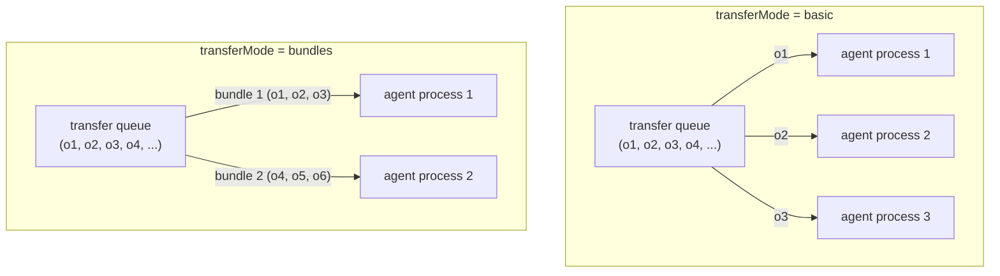
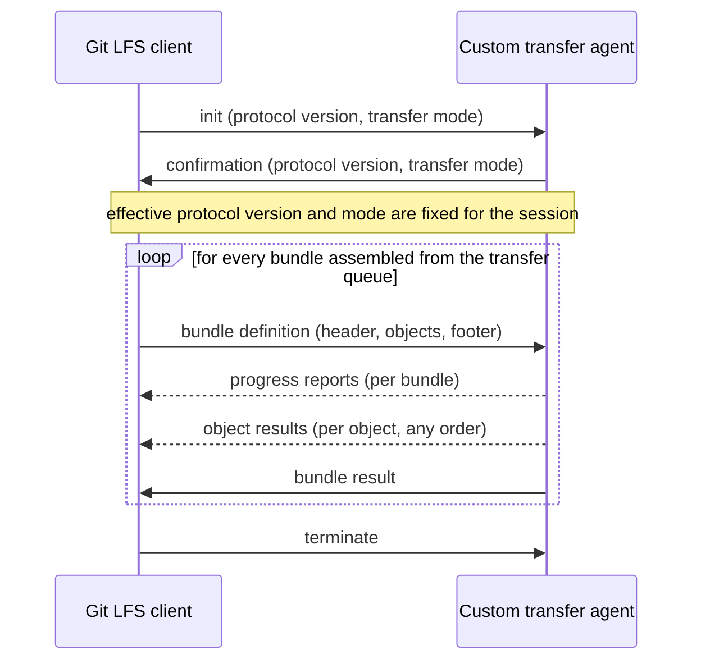

This document describes a proposal to extend custom transfer capabilities in Git LFS by allowing custom transfer agents to handle a set of objects per transfer, instead of processing one object at a time. This change aims to address limitations related to file size and single file data when dealing with large repositories with high numbers of objects. The proposal introduces the concept of 'transfer mode' and 'protocol version' to manage the new behavior while maintaining backward compatibility with existing custom transfer agent implementations.

# Problem statement
Currently custom transfer agent is responsible for transferring a single object between client/server. Git LFS is responsible for object set discovery and scheduling the transfers. After Git LFS discovers the set of objects to transfer, the transfers are scheduled one by one in a linear queue. Single transfers are then distributed to the custom transfer agents for processing one by one, single object per process. 

This approach is simple and works well for a whole lot of repositories, but it becomes inefficient when dealing with significantly large numbers of objects in repository or extremely small/large objects, as it does not take advantage of potential optimizations that could be achieved by processing multiple objects together.

Two main limitations take place with the current approach:
- File size limitation.
Transferring one object per process makes little sense for files smaller than some magic number due to the overhead of process creation and management, network overheads and natural process count limits per system. The exact mileage may vary, but each concrete setup will have a magic number that defines the lower bound of file size applicable effectively. Going below this magic number will lead to poor 
overall operation times: download/upload times per object will stop decreasing along with object sizes and total pull/push operation times go up. For larger files this problem mutates into the opposite one, where the overhead of process creation and management becomes negligible compared to the actual transfer time, but the total pull/push operation times go up due to the sheer number of transfers that need to be processed.
- Single file data limitation.
Transferring objects one by one limits the opportunity to optimize network traffic size by compressing the objects or using other strategies that are more efficient when transferring multiple objects in a single session. This is especially true for text files that can be compressed well and the compression ratio improves with the size of the data involved. This might seem as a counterintuitive statement in terms of git, but a lot of modern game engines for example use text based assets (json, yaml, xml, etc) that can reach hundreds of MBs in size when uncompressed or large numbers of small files. For big projects the amount of such files can be in thousands and they typically have no distinct patterns that allow managing them on the configuration level.

# Proposal statement
Lets allow custom transfers to handle a set of objects per transfer to address the limitations mentioned above. 
- File size limitation.
    Allowing transfer agents to handle a set of objects per transfer allows them to optimize the transfer process for small files, for example by grouping multiple small files together into a single transfer session. This can reduce the overhead associated with process creation and management, as well as network overheads, leading to improved overall performance when dealing with large sets of small objects.
- Single file data limitation.
    Allowing transfer agents to handle a set of objects per transfer also allows them to optimize the transfer process for large files, for example by compressing multiple objects together or using more efficient binary protocols. This can reduce the overall transfer time for large sets of objects, especially when dealing with large text files that can be compressed well.

# Concepts and Terms
To describe this proposal specifics lets introduce a basic concept and some terms.
Effectively we change how the transfer queue is processed by custom transfer agents: instead of processing one object from the queue per time, the agent process a set of objects per time. 
To name this change we introduce the concept of `transfer mode`, which defines the unit of work handed to a custom transfer agent process: a single object or a set of objects. 
We name the current behavior `basic` mode, where a single object is processed per a single custom transfer agent process. The queue is processed per object. 
The new behavior proposed here is `bundles` mode, where `bundle` is a set of objects that are processed per a single custom transfer agent process. The queue is processed per bundle. The specifics of how a specific object or bundle is processed is a responsibility of the custom transfer agent implementation. We only provide a clear way of defining the bundle to a process.

The difference between the two transfer modes can be illustrated as follows:

In the basic mode every agent process receives a single object per transfer operation and reports the result for it before receiving the next one. In the bundles mode every agent process receives a whole bundle per transfer operation and reports the progress and the results for all the objects of the bundle before receiving the next bundle. The bundle composition is a Git LFS responsibility: the agent receives an explicitly defined bundle and never has to guess about the transfer queue state.

Important consideration here is that the 'transfer mode' should be aligned with 'concurrency' concept, meaning that changing the 'transfer mode' to 'bundles' will lead to more than one bundle being processed concurrently with different custom transfer agent processes. Though there is no intention to enforce any specific behaviour, we do not introduce a parallel transfer queues cause it does not bring any resolution to the described limitations. The intended usage of this proposal implementation is to have less network traffic and less amount of download/upload sessions between client and server, so concurrency in a concrete implementations should apply 'per bundle'.
For example compressing a bundle of objects via zstd or gzip and transferring a single compressed file per bundle is a good illustration of the intended usage.

To implement this proposal we'll have to change the custom transfer protocol to allow defining a bundle of objects to be processed by a single custom transfer agent process. This will involve changes to the way the transfer queue is processed and how the objects are defined and passed to the custom transfer agent processes. To maintain backward compatibility with existing custom transfer agent implementations, we introduce the `protocol version` concept, which defines the version of the custom transfer protocol being used. The 'protocol version' can be set to either '1' (the current behavior) or '2' (the new behavior proposed here).

# Backward compatibility and opt-in behavior
We want this proposal implementation to be completely optional and backward compatible, meaning that existing custom transfer agent implementations should continue to work without any changes, and users should be able to opt-in to the new behavior by changing the 'transfer mode' and 'protocol version' settings explicitly. 

The default behaviour should correspond to the current implementation, meaning that the default 'transfer mode' should be 'basic' and the default 'protocol version' should be '1'. This way users will have to explicitly opt-in to the new behavior by changing the settings.

# Server and Batch API considerations
This proposal does not affect the Git LFS Batch API or the existing vendor LFS server implementations in any way. The transfer mode is negotiated between Git LFS and the custom transfer agent on the initiation stage of the custom transfer protocol, after the Batch API exchange is complete. No new Batch API fields and no server side negotiation are introduced, so the existing server implementations, including the ones that do not support custom transfers at all, require no changes.

At the same time this feature is not client only: a working bundles setup requires a server side that actually supports it. The storage server behind the custom transfer agent has to accept the client uploads in bundles and to serve the downloads in a way the client can consume them (for example accept and serve compressed bundle archives). This is a natural part of any custom transfer implementation: a custom transfer agent always implies a server counterpart that understands its transfer scheme, and the bundles support becomes another capability of that pair. This is also the reason the capability negotiation belongs to the custom transfer protocol and not to the Batch API: only the custom transfer agent knows whether its server counterpart supports the bundle transfers.

An earlier iteration of this proposal included a Batch API extension for negotiating the transfer mode with the server. It was dropped from the proposal for the reasons above. Instead the `bundleSize` default value is aligned with the `lfs.transfer.batchSize` default value, so that by default a single Batch API response can be processed as a single bundle.

# Configuration
To implement the proposed changes, we need to add new configuration values for the 'transfer mode' and 'protocol version'. Also the bundles mode will require a new configuration value for the 'bundle size', which defines the maximum number of objects that can be included in a single bundle. This will allow users to control the behavior of the transfer process and optimize it for their specific use cases.

We'll need to add the following configuration values:
- `lfs.customtransfer.<name>.protocol`: defines the version of the custom transfer protocol being used, can be set to either `1` or `2`. Default is `1`.
- `lfs.customtransfer.<name>.transferMode`: defines the transfer mode, can be set to either `basic` or `bundles`. Default is `basic`.
- `lfs.customtransfer.<name>.bundleSize`: defines the maximum number of objects that can be included in a single bundle. The number of objects in the bundle can be less if there is not enough objects left to transfer, but never exceed this value. Default is `100`. 

To enable the new behavior, users will need to set the `lfs.customtransfer.<name>.protocol` to `2` and the `lfs.customtransfer.<name>.transferMode` to `bundles`. This will allow them to take advantage of the new capabilities while maintaining backward compatibility with existing custom transfer agent implementations.
This seems a bit overburdened, but since we introduced the protocol version concept, we need to provide a way to define the new behavior without affecting the existing implementations, and this is the most straightforward way to do it. 
The `lfs.customtransfer.<name>.bundleSize` default value is set to `100` to align with the `lfs.transfer.batchSize` default value, meaning that by default a single batch request will be processed by a single custom transfer agent process. 

# Custom transfer protocol changes
To implement the proposed changes, we need to modify the custom transfer protocol to support the new 'bundles' transfer mode and the 'protocol version' concept.
The protocol version should define the entire behaviour and the available capabilities for the transfer process. Git LFS needs a way to negotiate the protocol version with the transfer agent process to ensure that both sides agree on the version of the protocol being used. Protocol version cannot be changed once the transfer process is initialized. 
This can be done by including the protocol version in the 'init' stage of the protocol, where the transfer agent can approve the version in the response message. This way we can maintain backward compatibility with existing custom transfer agent implementations, as they will continue to use protocol version 1, while new implementations can take advantage of the new capabilities introduced in protocol version 2.
The protocol stages for 'bundles' mode will be similar to the current implementation, but with some modifications to accommodate the new behavior. We need a clear way to define the bundle of objects to be processed by a single custom transfer agent process, and to track the progress of the overall bundle and involved single objects instead of a single object.

The high level flow of a custom transfer session using the proposed protocol version 2 looks like this:

The detailed protocol specification for the version 2 is provided in the separate [protocol specification document](./custom-transfers-bundling-protocol.md) to keep this proposal focused on the high level changes and concepts.

# Implementation details
Some of the proposed changes have implementation details that should be considered or discussed further. As a baseline for this discussion a draft implementation of this proposal can be read in the following pull request: https://github.com/git-lfs/git-lfs/pull/6119

Several important things were learned during the draft implementation that should be considered here.

1. Error retries.
The current version of the custom transfer protocol does not support error retries and always falls back to the default transfer agent in case of any error reported from the custom transfer agent. This effectively means that in case of any retriable error the transfer agent is bound to implement all the retry logic on its own. When the custom agent retries on its own the user sees weird misleading data about the download/upload progress, cause there is no clear way to report the progress of retries to the Git LFS client. Meanwhile reporting the errors means that the Git LFS client will fall back to the default transfer agent, which is not desired in any general case.
To address this, protocol version 2 defines an optional `retry` flag for both single object and bundle completion messages. A bundle can be reported as successful while some of its objects are marked for retry: the successfully transferred objects are used and the rest are included into a following bundle transfer. Reporting a non-retriable bundle failure triggers the fallback to the `basic` mode without losing the progress already made.
The retry mechanism is independent from the bundles transfer mode: if preferred, it can be split out into a separate proposal and implemented incrementally, as the basic mode benefits from it on its own.

2. Transfer queue state visibility.
The current transfer queue implementation keeps the transfer queue state secret from the transfer agents. A transfer agent has no idea about the overall transfer queue content, so to maintain the operability it has to rely on an assumption: when the transfer queue has anything to transfer - the requests keep coming immediately, otherwise the agent waits for some time and then just flushes itself.
To avoid building such assumptions into every agent implementation, the bundle composition is a Git LFS responsibility: Git LFS assembles the bundles from the transfer queue according to the `bundleSize` setting and explicitly closes every bundle definition sent to an agent process. When the queue has fewer objects left than the configured `bundleSize`, Git LFS flushes the remaining objects as a smaller bundle instead of waiting for a full one, so an agent never has to guess about the queue state.

3. Progress reporting granularity.
Since an agent is free to choose any processing strategy for a bundle (sequential, parallel, a single compressed archive, etc), per-object progress is not always possible to report. Protocol version 2 tracks the transfer progress per bundle, while the completion is still tracked per object to allow partial bundle results and retries.
